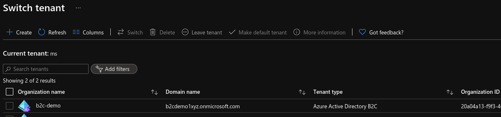

# **Azure B2C tenant**

B2C docs to interact with API available [here](https://docs.microsoft.com/en-us/rest/api/activedirectory/b2ctenants) .  


### \# **PRECONDITION**

To create new B2C tenant you have to use your private user or functional user registered in Azure Active Directory. It **can't** be a Service Principal.

```
## check if DOMAIN is free


# using 'az rest'

az login

SUBS=`az account show --query "id" -o tsv`

$ az rest --method post --url https://management.azure.com/subscriptions/$SUBS/providers/Microsoft.AzureActiveDirectory/checkNameAvailability?api-version=2019-01-01-preview --body @check.json
{
  "message": null,
  "nameAvailable": true,
  "reason": null
}


# using 'curl'

az login

TOKEN=`az account get-access-token --query accessToken --output tsv`

curl -i -X POST \
-H "Authorization: Bearer ${TOKEN}" \
-H "Content-Type: application/json" \
-d @check.json \
https://management.azure.com/subscriptions/$SUBS/providers/Microsoft.AzureActiveDirectory/checkNameAvailability?api-version=2019-01-01-preview

```

### \# **DEPLOYMENT**

Once you know that domain is free you can deploy B2C tenant either using `az rest` or using `terraform` with `az rest` .

### \# **az rest**

```
az login

SUBS=`az account show --query "id" -o tsv` \
RG=demob2c \
DOMAIN=b2cdemo1xyz \
LOCATION=westeurope

az group create --name $RG --location $LOCATION


# deploy

az rest --method put --url https://management.azure.com/subscriptions/$SUBS/resourceGroups/$RG/providers/Microsoft.AzureActiveDirectory/b2cDirectories/$DOMAIN.onmicrosoft.com?api-version=2019-01-01-preview --body @b2c.json --verbose


# get

az account tenant list

az rest --method get --url https://management.azure.com/subscriptions/$SUBS/resourceGroups/$RG/providers/Microsoft.AzureActiveDirectory/b2cDirectories/$DOMAIN.onmicrosoft.com?api-version=2019-01-01-preview | jq


# delete

az rest --method delete --url https://management.azure.com/subscriptions/$SUBS/resourceGroups/$RG/providers/Microsoft.AzureActiveDirectory/b2cDirectories/$DOMAIN.onmicrosoft.com?api-version=2019-01-01-preview --verbose

> verify if B2C tenant was removed then remove the Resource Group

az group delete --name $RG
```


### \# **terraform**

It's really up you how do you want to pass vars. This is just an example.

```
az login

RG=demob2c \
DOMAIN=b2cdemo1xyz \
LOCATION=westeurope

terraform init
terraform plan -var domain=$DOMAIN -var rg=$RG -var location=$LOCATION -out=out.plan
terraform apply out.plan
```
If completed succesfully, after some time you should see a new tenant. Go to Azure portal or check using az-cli:  
`portal/Azure Active Directory/Overview/Manage tenants`  



```
# check

SUBS=`az account show --query "id" -o tsv`

az account tenant list

az resource show --ids /subscriptions/$SUBS/resourceGroups/$RG/providers/Microsoft.AzureActiveDirectory/b2cDirectories/$DOMAIN.onmicrosoft.com


# delete

terraform destroy -var domain=$DOMAIN -var rg=$RG -var location=$LOCATION
rm -rf out.plan .terraform* terraform.*
```

### \# **IMPROVEMENTS**

### **delete**

if you switch to a new tenant in Azure Portal, `az rest --method delete` won't work, instead to remove you have to do it either manually or automate it - you will get a checklist with preconditions to be done to allow removal (try, you will see)

### **python library**

there is available python package `azure-mgmt-azureadb2c` for b2c, you can find more details [here](https://docs.microsoft.com/en-us/python/api/azure-mgmt-azureadb2c/azure.mgmt.azureadb2c.v2019_01_01_preview.operations.b2ctenantsoperations?view=azure-python-preview)  
